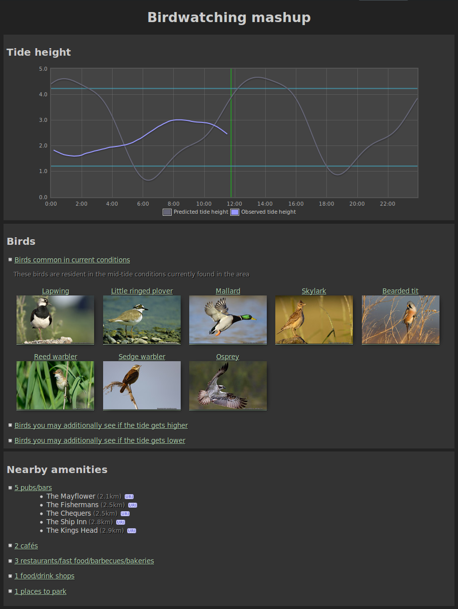

Coding a mashup: birdwatching
=============================

As an example of using the HLAPI this section describes how a "birdwatching" 
mashup application was built.

The purpose of this mashup is take tide height data from the HLAPI and predicted 
tide height from a different source for a particular area, plot this data on a 
graph and alongside show the various birds which one might expect to see in the 
area at this tide level. At the same time related information is picked up from 
other sources such as lists of nearby amenities.

Data sources
------------

Nearby amenity data is provided by [Linked Geodata][lgd] and bird information by 
[BBC Nature][bbcn], both as linked data.

[lgd]: http://linkedgeodata.org/
[bbcn]: http://www.bbc.co.uk/nature/

Scripting language and libraries
--------------------------------

This example uses the [PHP][php] scripting language. For Sparql queries and RDF 
manipulation it uses the [Arc2][arc2] library and, for ease of coding and 
readability, [Graphite][graphite]. The [Flot][flot] Javascript library (a 
[Jquery][jquery] plugin) is used for charts.

Another useful tool is an RDF browser such as the [Q&D RDF Browser][qdbrowser].

[php]: http://php.net/
[arc2]: http://arc.semsol.org/
[graphite]: http://graphite.ecs.soton.ac.uk/
[flot]: http://code.google.com/p/flot/
[jquery]: http://jquery.com/
[qdbrowser]: http://graphite.ecs.soton.ac.uk/browser/

Setting up the graph
--------------------

First we define some namespaces, load in the Arc2 and Graphite libraries and set 
up a new Graphite graph and tell it to use our namespaces.

	$ns = array(
		"id-semsorgrid" => "http://id.semsorgrid.ecs.soton.ac.uk/",
		"ssn" => "http://purl.oclc.org/NET/ssnx/ssn#",
		"ssne" => "http://www.semsorgrid4env.eu/ontologies/SsnExtension.owl#",
		"DUL" => "http://www.loa-cnr.it/ontologies/DUL.owl#",
		"time" => "http://www.w3.org/2006/time#",
		"bbc" => "http://www.bbc.co.uk/",
		"po" => "http://purl.org/ontology/po/",
		"wo" => "http://purl.org/ontology/wo/",
		// ...more namespaces
	);
	require_once "arc/ARC2.php";
	require_once "Graphite/graphite/Graphite.php";
	$graph = new Graphite($ns);

It's also useful to tell Graphite to cache the RDF files it downloads:

	$cachedir = "/tmp/mashupcache/graphite";
	if (!is_dir($cachedir))
		mkdir($cachedir, 0777, true)
	$graph->cacheDir($cachedir);

Getting the latest tide height data
-----------------------------------

The CCO tide height sensor closest to our chosen area is the `lymington_tide` 
sensor. Since we know how our HLAPI is configured, we know the REST service URI 
for its latest tide height data and so can load the data into our graph 
directly.

	$tideobservationsURI = "id-semsorgrid:observations/cco/lymington_tide/TideHeight/latest";
	if ($graph->load($tideobservationsURI) == 0)
		die("failed to load any triples from '$tideobservationsURI'");

This directs Graphite to load the resources into a graph -- Graphite and the 
HLAPI will automatically negotiate a content type which can be used. We're using 
the namespace we defined above for brevity.

Graphite allows the graph to be rendered directly as HTML to quickly visualize 
what is available, the same can be achieved by using a dedicated RDF browser.

	echo $graph->dump();

From inspection of the result the links to use to get from one URI to another 
can be found. To load the sensor's document into the graph (and so get 
information about the sensor) we find any `ssn:Observation` resource's 
`ssn:observedBy` property -- that's the sensor -- and load it.

	// get sensor
	$sensor = $graph->allOfType("ssn:Observation")->get("ssn:observedBy")->current();
	if ($sensor->isNull())
		die("no observations");
	if ($sensor->load() == 0)
		die("couldn't load sensor RDF");

From there we can get the sensor's coordinates (again, inspecting the graph with 
the `dump` method is useful for determining the links to use):

	// get sensor coordinates
	$location = $sensor->get("ssn:hasDeployment")->get("ssn:deployedOnPlatform")->get("sw:hasLocation");
	if ($location->isNull())
		die("couldn't get sensor coordinates");
	$coords = array(
		floatVal((string) $location->get("sw:coordinate2")->get("sw:hasNumericValue")),
		floatVal((string) $location->get("sw:coordinate1")->get("sw:hasNumericValue")),
	);

In order to produce a graph of the tide height readings they need to be 
collected together and sorted by time.

	// collect times and heights
	$tideobservations = array();
	foreach ($graph->allOfType("ssn:Observation") as $observationNode) {
		// skip observations which are not of the tide height
		if ($observationNode->get("ssn:observedProperty") != "http://www.semsorgrid4env.eu/ontologies/CoastalDefences.owl#TideHeight")
			continue;

		// ensure the time node is a type we can understand
		$timeNode = $observationNode->get("ssn:observationResultTime");
		if (!$timeNode->isType("time:Interval"))
			continue;

		// add a (time, reading) pair to the array of observations
		$tideobservations[] = array(strtotime($timeNode->get("time:hasBeginning")),
			floatVal((string) $observationNode->get("ssn:observationResult")->get("ssn:hasValue")->get("ssne:hasQuantityValue")));
	}

	// sort in ascending date order
	usort($tideobservations, "sortreadings");
	function sortreadings($a, $b) {
		return $a[0] - $b[0];
	}

Predicted tide height data
--------------------------

At present there is no CCO tide height data for our chosen location and so we 
pull that in from another source. The BBC has this data but not in a easily 
machine parsable format. A script was written to scrape it and republish it as 
plain text, but the workings of this are not relevant to this mashup.

Getting linked data from the BBC
--------------------------------

We want to show any subset of a whitelist of bird species (which we know to be 
found in our chosen area -- the BBC currently doesn't have linked data showing 
which particular areas each species live in, only the sort of habitats) which 
are resident in habitats similar to the our chosen area's current state.

The whitelist is specified like this:

	$whitelist = array(
		$graph->resource("bbc:nature/life/Nothern_Lapwing#species"),
		$graph->resource("bbc:nature/life/Little_Ringed_Plover#species"),
		// ...more species
	);

You may wonder how these URIs were found -- in the case of the BBC this could 
easily have been done simply by browsing the HTML site to find the required 
birds, then looking at the RDF representation to find the URI. Another way (and 
the way the URIs were found in this case) is to start from the URI for birds, 
then recursively load all orders, families, geni and species. The graph can then 
be inspected and the suitable bird URIs picked out. That would look something 
like the following:

	$graph->load("bbc:nature/life/Bird");
	foreach (array("wo:Order", "wo:Family", "wo:Genus", "wo:Species") as $type)
		foreach ($graph->allOfType($type) as $resource)
			$resource->load();
	echo $graph->dump();

Note that this takes a long time to load! Obviously the logic can be removed 
once the desired birds' URIs are known.

The birds' data are loaded into the graph.

	foreach ($whitelist as $species)
		$species->load();

Getting subsets of birds based on tide height
---------------------------------------------

First we define a function which returns all birds who live in a particular 
habitat:

	function getbirds($habitat) {
		global $graph;

		$birds = array();
		foreach ($graph->allOfType("wo:Species") as $species)
			foreach ($species->all("wo:livesIn") as $livesin)
				if ($livesin->uri == $habitat->uri) {
					$birds[] = $species;
					break;
				}

		$birds = new Graphite_ResourceList($graph, $birds);
		$birds = $birds->distinct();
		return $birds;
	}

We also perform some logic to determine the current tide height (using the last 
observation) and set up thresholds at which the area will be suitable for birds 
who live in the various different habitat types.

The logic to get birds which may be present in particular tide conditions and 
which birds may additionally show up if the tide gets higher or lower, then, 
looks something like the following:

	$wetlandbirds = getbirds($graph->resource("bbc:nature/habitats/Wetland#habitat"));
	$marshbirds = getbirds($graph->resource("bbc:nature/habitats/Marsh#habitat"));
	$swampbirds = getbirds($graph->resource("bbc:nature/habitats/Swamp#habitat"));
	$bogbirds = getbirds($graph->resource("bbc:nature/habitats/Bog#habitat"));

	$lowbirds = $wetlandbirds->intersection($whitelist);
	$midbirds = $marshbirds->intersection($whitelist);
	$highbirds = $marshbirds->union($swampbirds)->union($bogbirds)->intersection($whitelist)->distinct();

	if ($currentheight < $lowthreshold) {
		$currentlevel = "low";
		$currentbirds = $lowbirds;
		$higherbirds = $midbirds->union($highbirds)->except($currentbirds)->distinct();
		$lowerbirds = null;
	} else if ($currentheight < $highthreshold) {
		$currentlevel = "mid";
		$currentbirds = $midbirds;
		$higherbirds = $highbirds->except($currentbirds);
		$lowerbirds = $lowbirds->except($currentbirds);
	} else {
		$currentlevel = "high";
		$currentbirds = $highbirds;
		$higherbirds = null;
		$lowerbirds = $lowbirds->union($midbirds)->except($currentbirds)->distinct();
	}

Getting linked data on nearby amenities from Linked Geodata
----------------------------------------------------------

We will use Linked Geodata's Sparql endpoint to get information on amenities 
close to the tide height sensor. By browsing Linked Geodata we can build a list 
of suitable amenity types, and then put together and send a query:

	$store = ARC2::getRemoteStore(array("remote_store_endpoint" => "http://linkedgeodata.org/sparql/"));
	$rows = $store->query("
		PREFIX lgdo: <http://linkedgeodata.org/ontology/>
		PREFIX geo: <http://www.w3.org/2003/01/geo/wgs84_pos#>
		PREFIX rdfs: <http://www.w3.org/2000/01/rdf-schema#>
		SELECT * WHERE {
			{ ?place a lgdo:CoffeeShop . }
			UNION { ?place a lgdo:Cafe . }
			UNION { ?place a lgdo:InternetCafe . }
			?place
				a ?type ;
				geo:geometry ?placegeo ;
				rdfs:label ?placename .
			FILTER(<bif:st_intersects> (?placegeo, <bif:st_point> ($gate["lon"], $gate["lat"]), 5)) .
		}
	", "rows");

The returned results include the coordinates of each matching amenity 
(`placegeo`), from which the distance to our area of interest can be calculated.

Presenting the data
-------------------

From here it is just a case of presenting the data. To give the graph of 
predicted and observed tide height using the Flot library, as well as markers 
for the tide height thresholds and the current time, code can be used similar to 
the following:

	

	

A list of the birds can be displayed with code such as

	<ul>
		<?php foreach ($currentbirds as $bird) { ?>
			<li>
				<h3><?php echo htmlspecialchars($bird->label()); ?></h3>
				<?php if (!$bird->get("foaf:depiction")->isNull()) { ?>
					
get("foaf:depiction")); ?>">

				<?php } ?>
				
<?php echo $bird->get("dct:description"); ?>

			</li>
		<?php } ?>
	</ul>

And a list of the nearby amenities with something like

	<ul>
		<?php foreach ($pubbar as $uri => $amenity) { ?>
			<li>
				<?php echo htmlspecialchars($amenity[0]); ?>
				(<?php echo sprintf("%.01f", distance($coords, $amenity[1])); ?>km)
			</li>
		<?php } ?>
	</ul>

Finished product
----------------

With a stylesheet added and a little more work the result can be something like 
the screenshot below.

